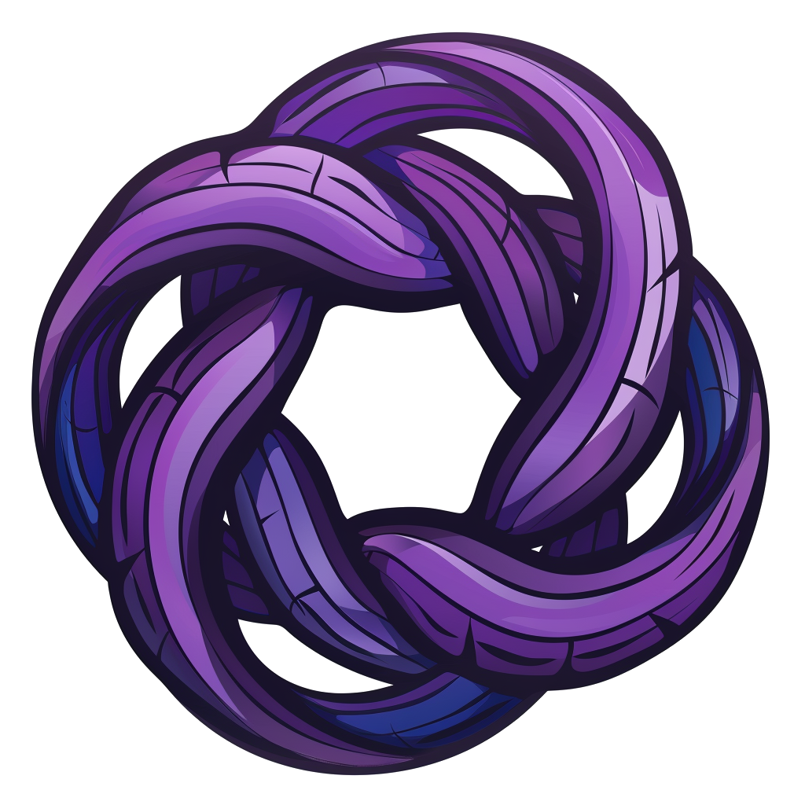

<div align="center">

<a href="https://github.com/AbdelStark/nostringer/actions/workflows/ci.yml"></a>
<a href="https://bitcoin.org/"> </a>
<a href="https://www.getmonero.org/"> </a>
<a href="https://github.com/nostr-protocol/nostr"> </a>

</div>

# Nostringer

<div align="center">
  
</div>

An easy-to-use Javascript/Typescript library providing **unlinkable ring signatures** (SAG) for Nostr pubkeys. It allows a signer to prove membership in a group of Nostr accounts without revealing which specific account produced the signature.

Nostringer is largely inspired by [Monero's Ring Signatures](https://www.getmonero.org/library/Zero-to-Monero-2-0-0.pdf) using Spontaneous Anonymous Group signatures (SAG), and [beritani/ring-signatures](https://github.com/beritani/ring-signatures) implementation of ring signatures using the elliptic curve Ed25519 and Keccak for hashing.

## Table of Contents

- [Nostringer](#nostringer)
  - [Table of Contents](#table-of-contents)
  - [Disclaimer](#disclaimer)
  - [Problem Statement](#problem-statement)
  - [Key Features](#key-features)
  - [Installation](#installation)
  - [Usage](#usage)
  - [API Reference](#api-reference)
    - [`sign(message: string | Uint8Array, privateKeyHex: string, publicKeysHex: string[]): RingSignature`](#signmessage-string--uint8array-privatekeyhex-string-publickeyshex-string-ringsignature)
    - [`verify(signature: RingSignature, message: string | Uint8Array, publicKeysHex: string[]): boolean`](#verifysignature-ringsignature-message-string--uint8array-publickeyshex-string-boolean)
    - [`RingSignature` Interface](#ringsignature-interface)
  - [Security Considerations](#security-considerations)
  - [License](#license)
  - [References](#references)

## Disclaimer

> **This code is highly experimental**.
> **I am not a cryptographer** and this library has not been audited or formally verified.  
> Use for educational exploration at your own risk. Production usage is **strongly** discouraged until further review and testing are performed.

## Problem Statement

In many scenarios, you want to prove that "someone among these N credentials produced this signature," but you do **not** want to reveal which credential or identity. For instance, you might have a set of recognized people / entities (Nostr pubkeys) who are allowed to post reviews or do priviledged actions, but you want them to be anonymous within that set.

A **ring signature** solves this problem by letting an **individual** sign a message with a group of possible public keys. A verifier can confirm that the message indeed came from **one** of those public keys, without knowing which.

## Key Features

- **Unlinkable**: Each signature hides the signer's identity. Two signatures from the same signer cannot be linked.
- **Compatible with Vanilla JS and Typescript**: Uses [@noble/secp256k1](https://github.com/paulmillr/noble-secp256k1) for curve ops and [@noble/hashes/sha3](https://github.com/paulmillr/noble-hashes) for Keccak-256 hashing.
- **BIP-340**: Directly supports Nostr x-only pubkeys (32-byte hex strings).
- **Easy to Use**: Simple `sign` and `verify` functions, minimal config needed.

## Installation

```bash
# using npm
npm install nostringer

# or using yarn
yarn add nostringer
```

## Usage

```js
import { sign, verify } from "nostringer";

// Example: 3-member ring, with 'signerSK' as the signer's private key in hex
const ringPubKeys = [
  "fa...1", // 32-byte hex: Nostr x-only pubkey #1
  "65...d", // #2
  "a0...9", // #3
];

const message = "Hello from ring signature land!";
const signature = sign(message, signerSK, ringPubKeys);

console.log("Generated signature:", signature);

// On the other side, to verify:
const isValid = verify(signature, message, ringPubKeys);
console.log("Is ring signature valid?", isValid);
```

## API Reference

### `sign(message: string | Uint8Array, privateKeyHex: string, publicKeysHex: string[]): RingSignature`

Signs a message using the SAG ring signature scheme.

- **message**: The message to sign (string or Uint8Array)
- **privateKeyHex**: The signer's private key (64-character hex string)
- **publicKeysHex**: Array of public keys in the ring (including the signer's key)
- **Returns**: A RingSignature object with `c0` (initial challenge) and `s` (array of responses)

### `verify(signature: RingSignature, message: string | Uint8Array, publicKeysHex: string[]): boolean`

Verifies a ring signature.

- **signature**: The ring signature object (`{ c0, s }`)
- **message**: The original message that was signed
- **publicKeysHex**: Array of public keys in the ring
- **Returns**: `true` if the signature is valid, `false` otherwise

### `RingSignature` Interface

```typescript
interface RingSignature {
  c0: string; // Initial challenge (64-char hex)
  s: string[]; // Array of responses (64-char hex strings)
}
```

## Security Considerations

- **Anonymity Set**: The larger the ring, the more anonymity it provides, but also increases signature size
- **No Trusted Setup**: Doesn't require any trusted setup or central authority
- **Unlinkability**: Signatures produced by the same signer cannot be linked together
- **Not Traceable**: Unlike some other ring signature schemes, this implementation doesn't include key images or linkability tags

## License

This project is licensed under the [MIT License](License).

## References

- [Linkable Spontaneous Anonymous Group Signature for Ad Hoc Groups](https://eprint.iacr.org/2004/027.pdf) - (Joseph Liu et al., 2004) – basis of LSAG.
- [Beritani, ring-signatures JS library](https://github.com/beritani/ring-signatures) – Ed25519 ring signature implementation (SAG, bLSAG, MLSAG, CLSAG)​.
- [Blockstream Elements rust-secp256k1-zkp library](https://github.com/BlockstreamResearch/rust-secp256k1-zkp) – Whitelist Ring Signature in libsecp256k1-zkp (C code exposed via Rust)​.
- [Zero to Monero 2.0 – Chapter 3, ring signature algorithms](https://www.getmonero.org/library/Zero-to-Monero-2-0-0.pdf).
- [Cronokirby Blog – On Monero’s Ring Signatures](https://cronokirby.com/posts/2022/03/on-moneros-ring-signatures), explains Schnorr ring signatures in detail​.

---

Started with love by [AbdelStark](https://github.com/AbdelStark) 🧡

Feel free to follow me on Nostr if you’d like, using my public key:

```text
npub1hr6v96g0phtxwys4x0tm3khawuuykz6s28uzwtj5j0zc7lunu99snw2e29
```

Or just **scan this QR code** to find me:


